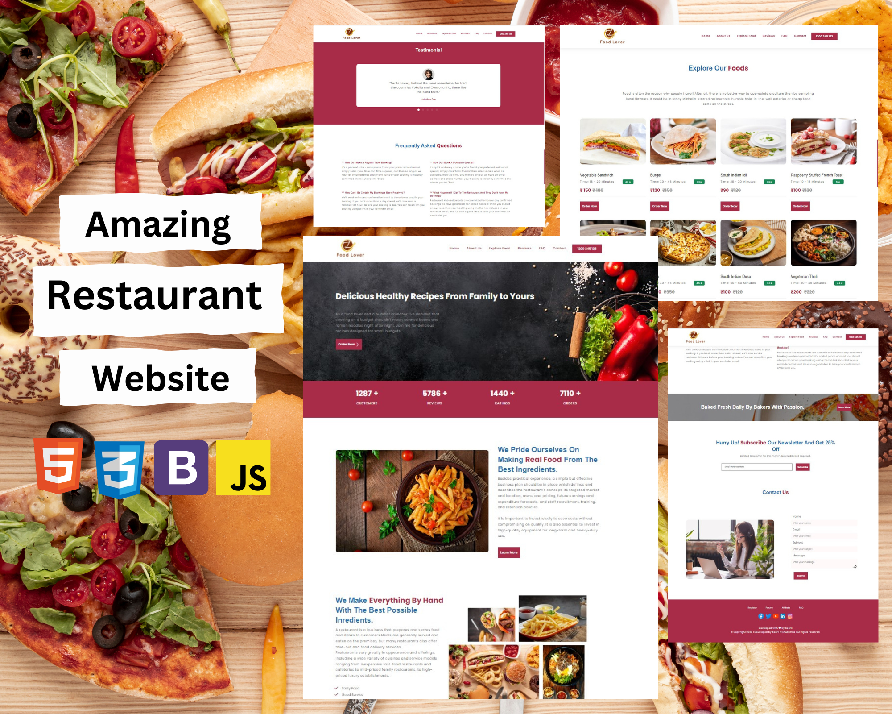

# Responsive-Restaurant-Website

A landing page template for a restaurant. It employs the use of HTML, CSS and Javascript to build it.

#### By **Keerti VIshwkarma**

## 📖 Description

This is a sample project of creating a Restaurant website that is for a restaurant to deliver its services via online website.
 
It consists of sections like home ,popular dishes, reviews, faq, contact ,finally about the restaurant and crew members of the restaurant followed by quick links of the page and social media links of the restaurant .

* A header section with the logo and navbar.
* A popular food type section.
* A fast food section.
* A customer testimonials and about the menu section.
* A mailing list subscribtion section.
* A contact section
* A footer section.
* Developed first with the Mobile First methodology, then for desktop.
* Compatible with all mobile devices and with a beautiful and pleasant user interface.

The website is filled with dummy text where needed. 

## 🚀 Setup/Installation Requirements

To view the website, 
* click [Responsive-Restaurant-Website](https://github.com/keerti1924/Responsive-Restaurant-Website.git)
or 
* copy the link https://github.com/keerti1924/Responsive-Restaurant-Website.git paste it to your browser and load it.  

## 🛠 Built With

* HTML
* CSS
* BOOTSTRAP
* JAVASCRIPT

This is my second independent project creating a Responsive Restaurant Website using HTML, CSS, Bootstrap and Javascript.

## 🤝 Contributing 

Contributions, issues, and feature requests are welcome! Feel free to check the [issues page](/issues).

## ⭐️ Show your support 

Give a ⭐️ if you like this project!

## 📝 License

MIT (c) [Keerti](https://github.com/keerti1924) 
